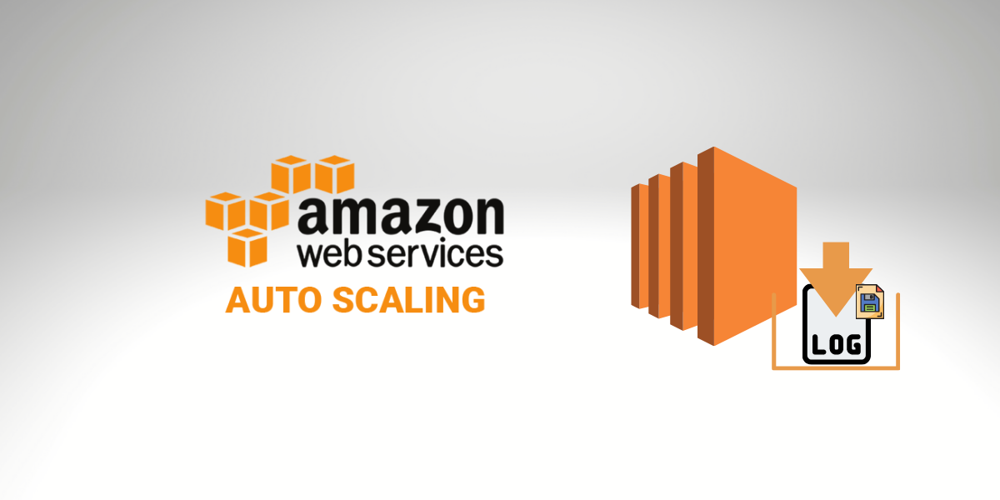
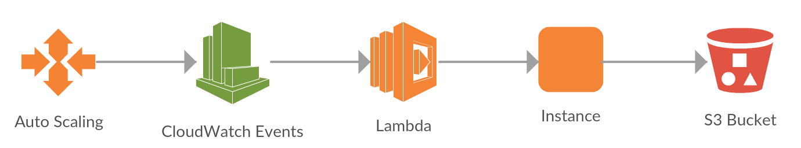

# AWS Autoscaling Lifecycle Hooks - Save EC2 Logs

## Goal
This project contains files to create a solution using Autoscaling Lifecycle Hook, to save and storage the EC2 instance logs on a S3 Bucket, before terminate the instance.

To achieve that goal we use the folling resources and services on AWS:

### What you need
- Autoscaling Group
- IAM Role and Policies
- S3 Buckets
- Lambda Function
- CloudWatch Rule
- Systems Manager (SSM) Document
- Run Command 

## Solution

## Documentation
[Autoscaling Lifecycle Hooks: Save EC2 Logs Automatically to S3 Bucket](https://www.bitslovers.com/autoscaling-lifecycle-hooks/)
